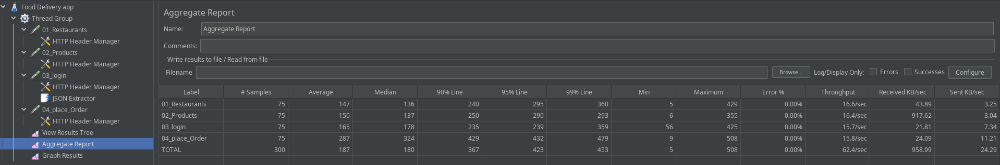
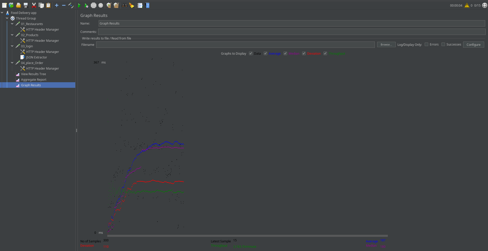
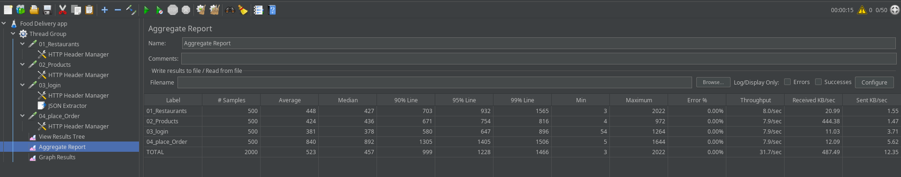
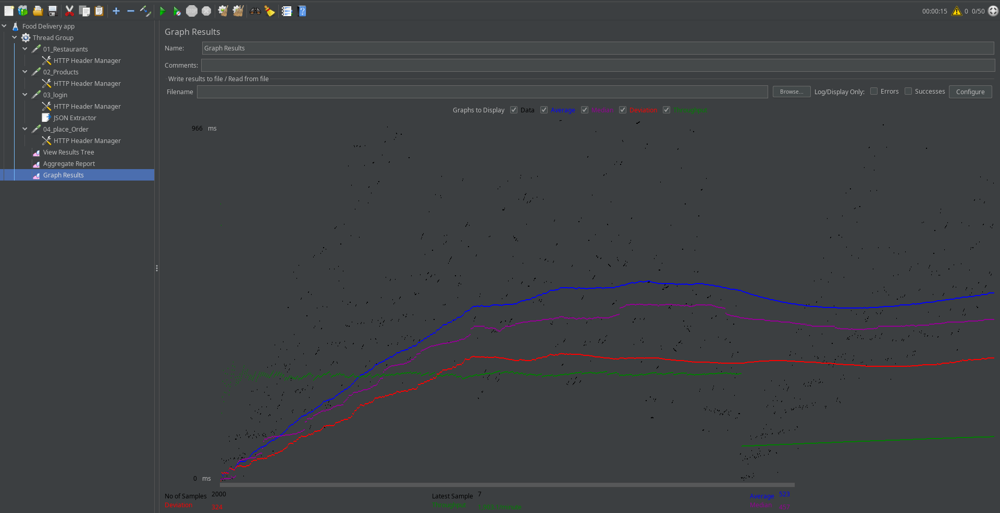

# Objective
This report presents the results of **performance testing** conducted on a Food Delivery Application using **Apache JMeter**. The objective of this performance test was to evaluate the response time, throughput, and reliability of key API endpoints of the Food Delivery Application under concurrent user load, and to identify potential performance bottlenecks.

# Test Environment

| Parameter | Value |
|--------|------|
| Performance Tool | Apache JMeter |
| Application Type | MERN Stack Food Delivery Application |
| Backend | Node.js + Express |
| Database | MongoDB |
| Environment | Localhost |
| Load Generator | local machine |

# Test Scenarios

| Scenario ID | API Endpoint | Method |
|-----------|-------------|--------|
| TS-01 | `/api/public/restaurants` | GET |
| TS-02 | `/api/public/products` | GET |
| TS-03 | `/api/auth/login` | POST |
| TS-04 | `/api/orders` | POST |

## Load Test Configuration (Baseline Test)

| Parameter | Value |
|--------|------|
| Concurrent Users | 15 |
| Ramp-up Period | 1 second |
| Loop Count | 5 |
| Test Type | Load Test |

---

## Load Test Results (15 Users)
A load test was conducted using 15 concurrent virtual users simulating real user behavior on the food delivery application. The test scenario included accessing multiple endpoints such as restaurants and products, as well as performing user authentication, which is a prerequisite for order placement. This approach enabled observation of system performance under concurrent load across both public and secured APIs. The test aimed to evaluate the server’s ability to handle concurrent traffic while maintaining acceptable response times, stable throughput, and reliable system behavior under expected operational load conditions.

### Aggregate Report Summary

### Graph View

### Load Test Observations of 15 users
- The load test executed 300 total requests across restaurants, products, login, and order placement APIs with 0% error rate, indicating stable application behavior under normal load conditions.

- Read-only endpoints (/restaurants and /products) demonstrated efficient performance, with average response times of 147 ms and 150 ms respectively. The 95th percentile response times remained below 300 ms, confirming good responsiveness for public APIs.

- The login API, which involves authentication and database validation, showed a slightly higher average response time of 165 ms, which is acceptable given the additional backend processing required.

- The order placement API exhibited the highest response time among all endpoints, with an average response time of 287 ms and a 95th percentile latency of 432 ms. This behavior is expected due to complex operations such as stock validation, order creation, and database updates.

- Overall system performance remained stable, with a total average response time of 187 ms and a 95th percentile latency of 423 ms, indicating that the majority of requests were served within acceptable limits.

- The system achieved a total throughput of approximately 62 requests per second, demonstrating the server’s ability to handle concurrent traffic efficiently without performance degradation.

The results indicate that the food delivery application can reliably support 15 concurrent users performing realistic user workflows, including browsing, authentication, and order placement, while maintaining acceptable response times and zero error rate under expected operational load.

# Stress Testing
Stress testing was performed by increasing the number of concurrent users to 50 with a ramp-up period of 5 seconds. This configuration intentionally subjected the system to a high request rate in order to observe performance degradation and error behavior beyond the normal operating load.

## Stress Test Configuration

| Parameter | Value |
|--------|------|
| Concurrent Users | 50 |
| Ramp-up Period | 5 seconds |
| Loop Count | 5 |
| Test Type | Stress Test  |

## Stress Test Results (50 Users)

### Aggregate Report Summary

### Graph View

## Stress Test Observations (50 concurrent users)

- The stress test executed a total of 2000 requests across all tested endpoints, including restaurants, products, login, and order placement APIs, with an overall error rate of 0%, indicating functional correctness under high load.

- A noticeable increase in response times was observed across all endpoints compared to the baseline load test. The overall average response time increased to 523 ms, with the 95th percentile reaching 1228 ms, demonstrating performance degradation under elevated concurrency.

- Read-only endpoints such as restaurants and products showed average response times of 448 ms and 424 ms, respectively. However, their 99th percentile latencies exceeded 1.5 seconds, indicating occasional high-latency responses during peak load.

- The login API maintained comparatively better performance with an average response time of 381 ms, though its 99th percentile latency approached 896 ms, suggesting increased authentication processing time under stress.

- The order placement API experienced the most significant performance impact, with an average response time of 840 ms, a 95th percentile latency of 1405 ms, and a maximum response time of 1644 ms. This reflects the computational and database-intensive nature of order processing under heavy load.

- System throughput increased to approximately 32 requests per second, indicating that the server continued to process a high volume of requests despite elevated response times.

The stress test demonstrated that while the application remained functionally stable under 50 concurrent users, performance degradation was evident in the form of increased response times, particularly for write-intensive operations such as order placement. This behavior highlights potential scalability limitations and areas for optimization when subjected to traffic beyond normal operating conditions.

# Conclusion
The performance testing of the food delivery application demonstrated stable behavior under normal operating conditions with 15 concurrent users. Stress testing with increased concurrency revealed performance degradation in the form of higher response times, particularly for order placement operations. Despite the increased load, the application remained functionally stable with no request failures. These results indicate that while the system can handle moderate traffic effectively, scalability improvements would be required to support higher concurrency levels in a production environment.

Testing was conducted in a local development environment where the load generator and application shared the same hardware resources. Therefore, observed performance limits reflect local system constraints and should not be interpreted as production-level capacity.